# evilTrust

Herramienta ideal para el despliegue automatizado de un **Rogue AP** con capacidad de selección de plantilla + 2FA.

Esta herramienta dispone de varias plantillas a utilizar, incluyendo una opción de plantilla personalizada, donde el atacante es capaz de desplegar su propia plantilla.

**IMPORTANTE**: No es necesario contar con una conexión cableada, por lo que es posible desplegar el ataque desde cualquier lado en cualquier momento.

¿Cómo funciona?
======
La herramienta comienza haciendo una comprobación de las utilidades necesarias para desplegar el ataque:

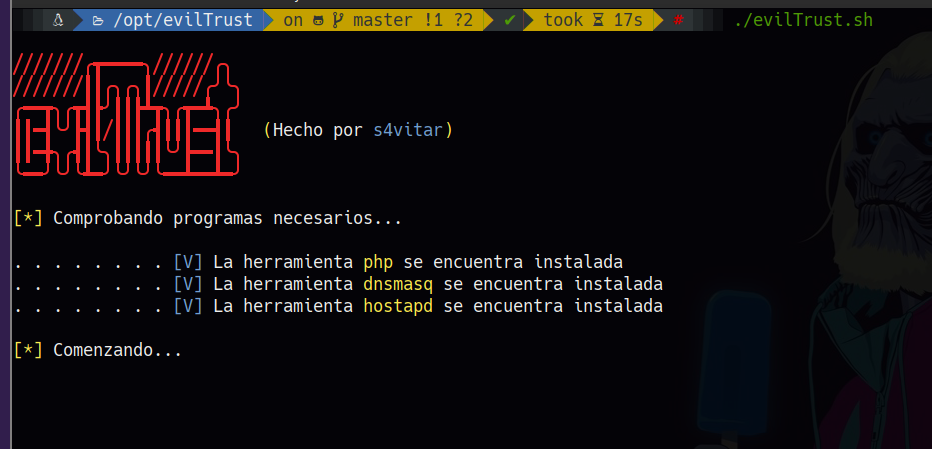

Una vez pasada la verificación, se listan las interfaces de red disponibles, siendo necesario en este punto seleccionar la interfaz configurada en modo monitor (se configura de manera automática):

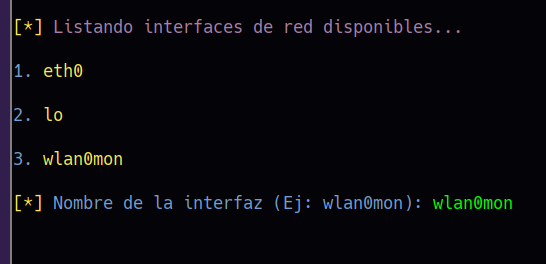

Tras seleccionar la interfaz en modo monitor, será necesario especificar el nombre del punto de acceso que se desee crear así como el canal en el que se desea que opere. Una vez especificado, se configurará la interfaz en modo monitor para que opere como router, asignado como puerta de enlace predeterminada la dirección IP **192.168.1.1**, actuando en modo **DHCP**.

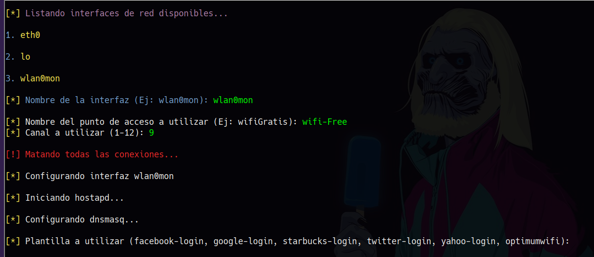

En este punto será necesario especificar la plantilla con la que se desea trabajar. Es importante seleccionar una de las plantillas listadas como ejemplo, especificando su nombre tal y como se muestra a continuación:

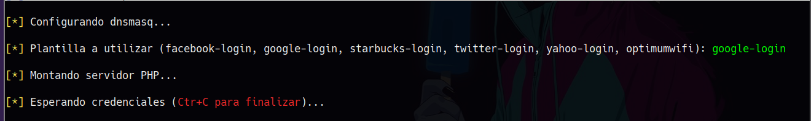

**IMPORTANTE**: Para fijar tu propia plantilla, simplemente crea un directorio en el directorio principal del proyecto y especifica su nombre, la herramienta de manera automática montará el servidor web en dicho directorio. La plantilla cliqq-payload dispone de un APK malicioso, ideal para obtener una sesión Meterpreter una vez la víctima la descargue y la ejecute.

**ANOTACIÓN**: La plantilla 'all_in_one' crea una portal cautivo centralizado para iniciar sesión listando todas las redes sociales.

Ya en este punto, se montará el punto de acceso y se dispondrá una ventana a la espera de obtener credenciales:

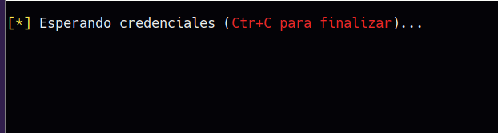

Desde el lado de la víctima, se podrá visualizar el punto de acceso creado. La víctima se conectará al AP (pues todos somos yonkis del WiFi :P) y recibirá el siguiente aviso:

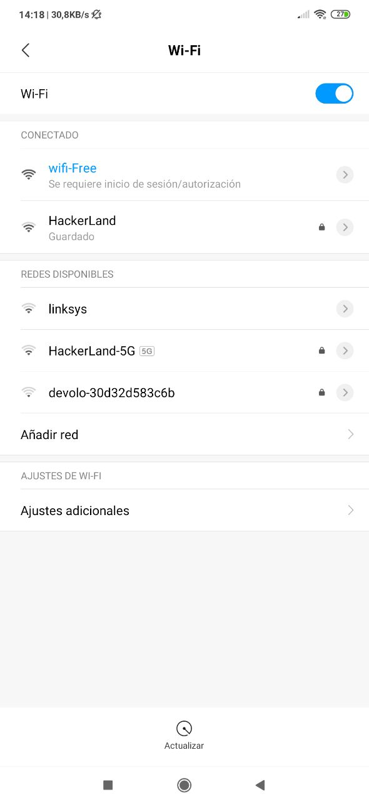

De manera automática, se abrirá el navegador mostrando la plantilla web configurada en la fase de selección:

La víctima introducirá sus credenciales, pues ve que para continuar navegando es necesario autenticarse bajo la plataforma seleccionada:

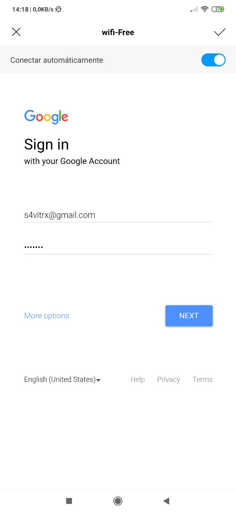

Una vez introducidas las credenciales, el atacante dispone de sus credenciales:

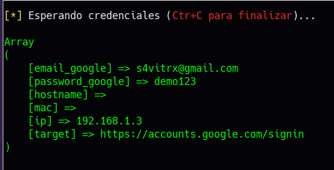

Para no quedarnos cortos, en caso de que la víctima disponga de segundo factor de autenticación configurado, tras introducir sus credenciales, la víctima es redirigida al siguiente portal web:

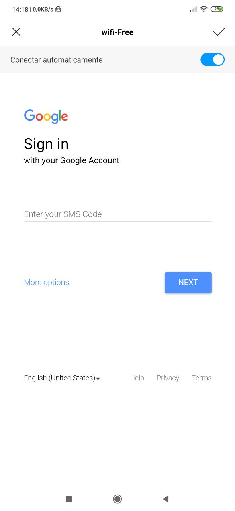

¿Por qué?, por lo siguiente. Dado que nosotros como atacantes disponemos de las credenciales de la víctima, de manera inmediata ya estaremos validando sus credenciales desde nuestro navegador. Si la víctima utiliza segundo factor de autenticación, tras iniciar sesión, nos saltará el aviso de que es necesario enviar un SMS al dispositivo móvil o correo electrónico para iniciar sesión.

¿Que la víctima no utiliza segundo factor de autenticación?, no pasa nada, ya tenemos sus credenciales :)

Como esta comprobación puede realizarse manualmente casi de manera inmediata, la víctima quedará a la espera de ese SMS. Por tanto, tras iniciar sesión de nuestro lado y enviar el SMS a la víctima, la víctima introduce el SMS recibido en su dispositivo:

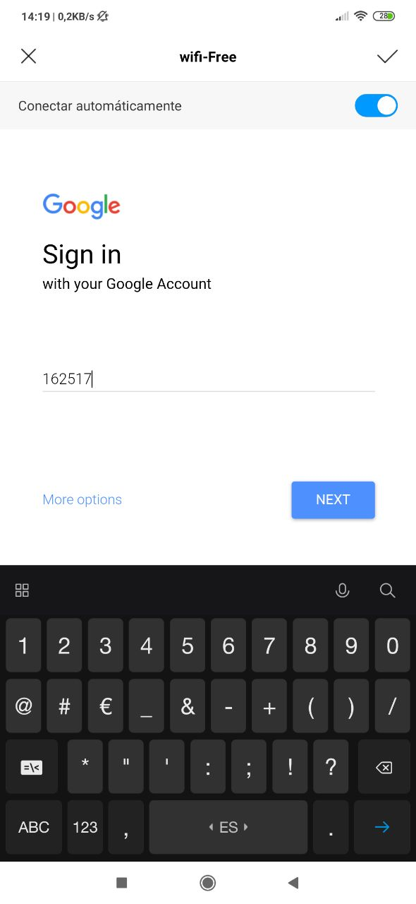

Y el atacante ahora, dispone del SMS necesario para acceder a su cuenta en ese intento de inicio de sesión:

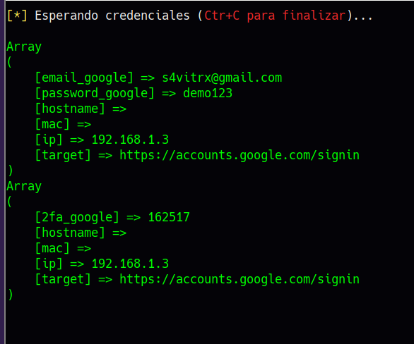

Dado que son múltiples plantillas, todos los datos recibidos están distinguidos por etiquetas que relacionan al portal que se está usando.

Requisitos
======
Para el correcto despliegue del atacante, simplemente es necesario contar con una tarjeta de red que acepte el modo monitor. El modo monitor se configura de manera automatizada tras la ejecución de la herramienta.

Al presionar la combinación Ctrl+C en cualquier momento, la interfaz de red volverá a su estado normal y todos los archivos temporales creados serán borrados.
